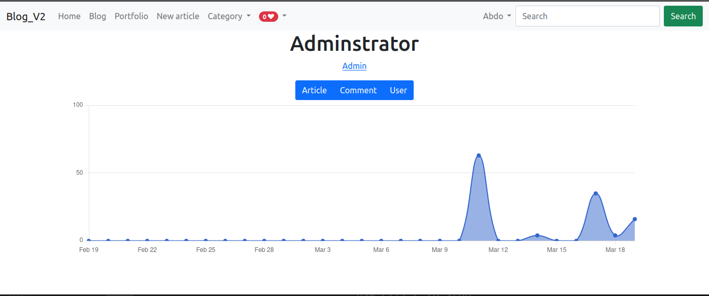
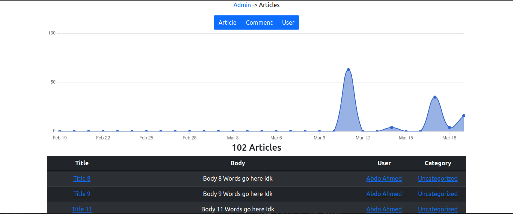
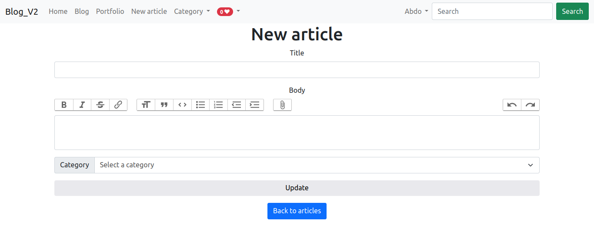
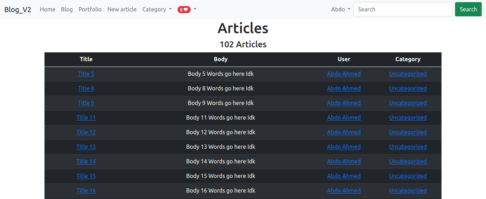
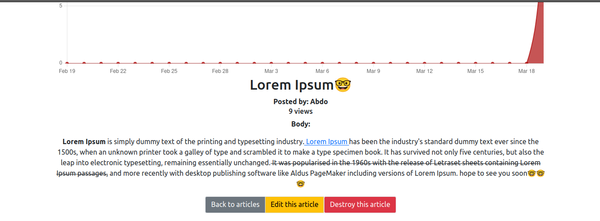
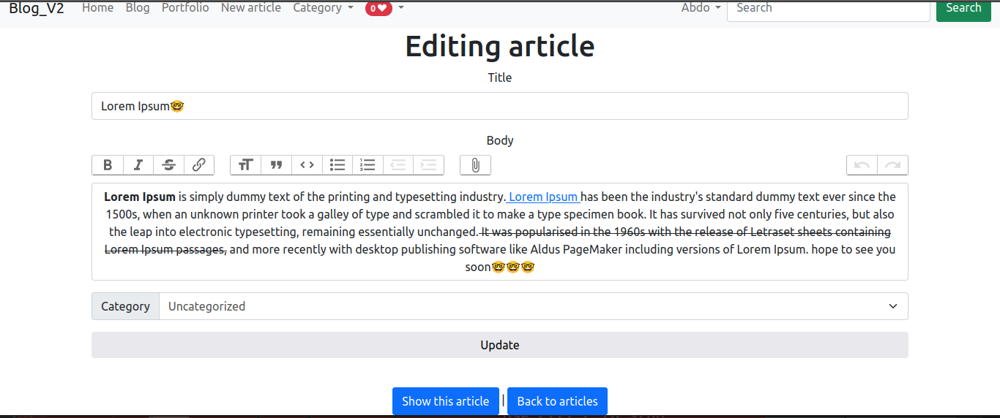
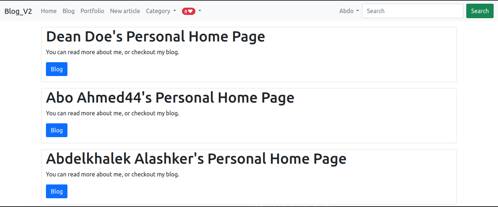
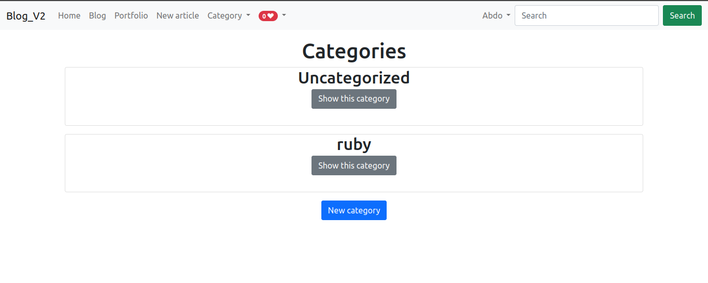
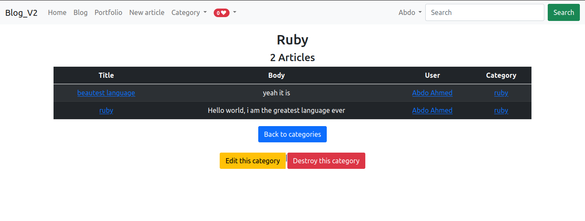

# Hash Node lite
this is Personal blog that any user can publish articles or whatever he thought the user should signup and publish articles and the othe users can comment on his article and can show his profile to read about him and his articles he wrote before.

# Table of Contents
* [Preview](#preview)
* [Technologies Used](#technologies-used-)
* [Tools Used](#tools-used-)
* [Dependences](#dependences-)
* [Run](#run-project)
* [Contributing](#contributing)
* [License](#license)

## Preview
  
  
  
  
  
  
  
  
  
  
  

  
  

## Technologies Used:-

  ### In the Backend

  * Ruby version "3.0.1"

  * Ruby On Rails as a framwork version "7.0.4"

  * DataBase I used  is SQLite3 DBMS but I switched to PostgreSQL DBMS.

  ### In the Frontend

  * HTML

  * CSS

  * Bootstrap5

  * Javascript

## Tools Used:-

  * VsCode

  * GitHub

  * Brave browser

  * Terminal

  * Operating system Linux Ubuntu 20.0.4

## Dependences:-

  1. Ruby version 3.0.1 using rbenv

  2. Rails version 7.0.4

  3. npm and Node.js

  4. PostgreSQL

## Run Project
   1. From your terminal run  ` $bundle install` to bunling the gems

   2. From your terminal run  ` $rails db:build ` command to build your database.

   3. Then run ` $rails db:migrate ` and ` $db:seed` commands to migrate database and to seed database if you want.

   4. Finally run ` $rails server ` and open the localhost on port 3000 to browse through the application.

   5. If errore occured the better_errors gem will help you, or go back to the terminal and run ` $rails console ` and start debugging.

## Contributing
   1. Clone the repository to your local machine using the following command:
    `$git clone https://github.com/abdelkhalekalashker/Blog_V2`.

   2. Fork the repository to your own GitHub account.

   3. Create a new branch with your changes: `$git checkout -b my-feature-branch`

   4. Commit your changes: `$git commit -am 'Add new feature'`

   5. Push your changes to your fork: `$git push origin my-feature-branch`

   6. Submit a pull request to the original repository.

## License

   mit license

